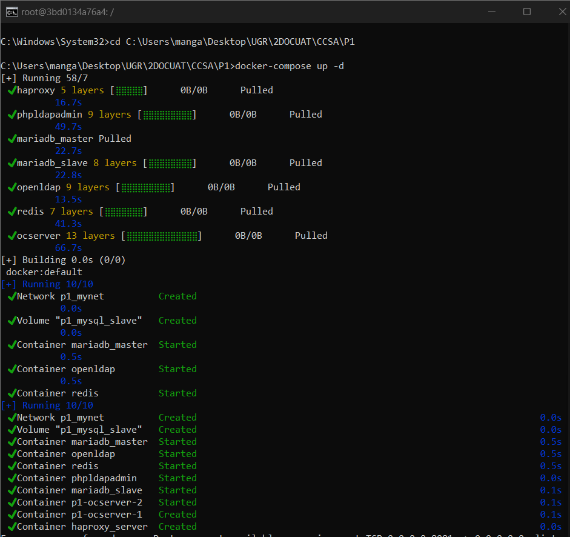
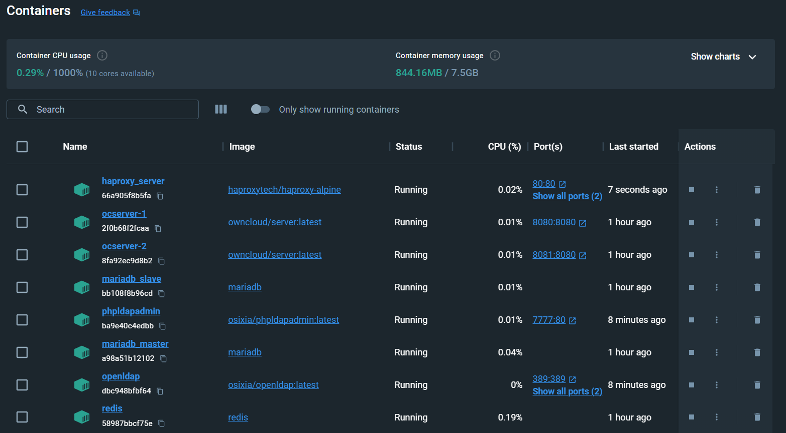
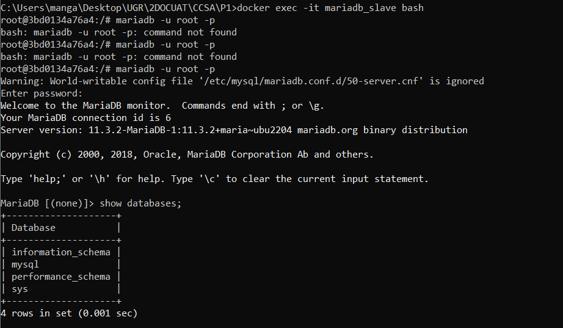
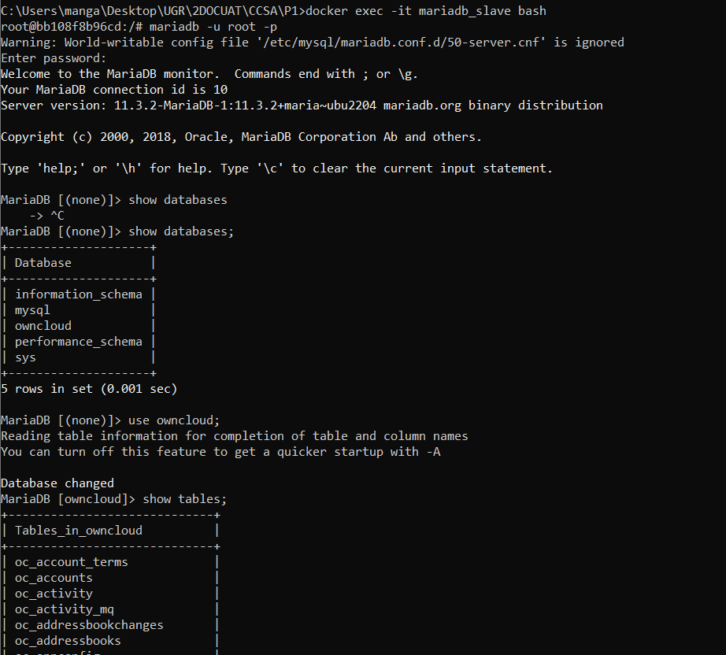

# Documentación de la Práctica: Despliegue de Servicio ownCloud

## Entorno de Desarrollo y de Producción
Para la práctica, el entorno de desarrollo ha sido el siguiente:

- **Sistema Operativo**: Microsoft Windows 11 Pro.
- **Hardware**:
  - **Procesador**: Intel® Core™ i7-9750H CPU @ 2.60GHz.
  - **Memoria RAM**: 16 GB (15,8 GB utilizable).
- **Docker Desktop**: Versión 4.25.2.
- **Docker Compose**: Versión v2.23.0-desktop.1.

## Descripción de la Práctica y Problema a Resolver
El objetivo de esta práctica es la creación de un entorno de servicios que nos permita almacenar y acceder a archivos y hacer esto de forma segura, consistente y eficiente. Para ello vamos a usar ownCloud, que es una plataforma genial de código abierto para almacenar y
compartir archivos. Además, para la práctica debemos gestionar usuarios y autenticar sus contraseñas (usando LDAP), mantener la base de datos al día (usaremos MariaDB), hacer que todo vaya más rápido con una caché (Redis). Finalmente,
para asegurarnos de que si un servidor se cae, otro pueda seguir funcionando, haremo uso de HAProxy.


## Servicios Desplegados y su Configuración
Los servicios implementados y configurados en la práctica son:

1. **Servicio web ownCloud**: Es nuestro servidor de archivos.  Está configurado para correr en dos puertos para que podamos tener dos instancias en marcha al mismo tiempo, para tener alta disponibilidad (si uno se cae, el otro sigue y los usuarios no lo notan).

2. **MariaDB**: MariaDB es donde se guarda toda la información sobre los archivos y los usuarios. Se ha configurado con una arquitectura maestro-esclavo para asegurar persistencia y escalabilidad de los datos.

3. **Redis**: Utilizado como almacenamiento en caché para mejorar el rendimiento del servicio ownCloud y que no deba acceder a la base de datos constantemente.

4. **OpenLDAP**: Este es un servicio crucial para la práctica ya que sirve para la autenticación de usuarios, con la configuración necesaria para la gestión de los mismos y la seguridad del servicio.

5. **HAProxy**: Por ltimo, HAProxy se encarga de repartir la carga para que no se sature ningún servidor de onwCloud.

(Para cada servicio, se debe incluir una explicación detallada de las configuraciones y el archivo `docker-compose.yml` utilizado en la práctica, así como cualquier otro archivo de configuración relevante.)

### Configuración Específica

#### HAProxy
El servicio `haproxy` para balancear la carga escucha en los puertos 80 y 8404 y redirecciona el tráfico hacia el servicio `ocserver`, que es el servidor de ownCloud.

- **Imagen**: Se utiliza `haproxytech/haproxy-alpine` para un balanceo de carga eficiente y ligero.
- **Red**: Conectado a la red `mynet`.
- **Volúmenes**: Se monta el directorio local `./haconfig` al directorio de configuración de HAProxy dentro del contenedor para cargar la configuración personalizada.
- **Dependencias**: Depende del servicio `ocserver` para el funcionamiento.

#### ownCloud Server
El `ocserver` es el servicio ownCloud, para la interfaz web y el acceso a los archivos.

- **Imagen**: Se usa la versión especificada por la variable `${OWNCLOUD_VERSION}` de ownCloud.
- **Red**: Conectado a la red `mynet`.
- **Puertos**: Los puertos 8080 y 8081 están expuestos y mapeados al puerto 8080 del contenedor.
- **Volúmenes**: Se monta un volumen local para la persistencia de datos.
- **Variables de Entorno**: Se definen todas las variables necesarias para la configuración, incluyendo el dominio, base de datos y credenciales de administrador.
- **Replicación**: Se configura para tener 2 réplicas para alta disponibilidad.

#### MariaDB (Maestro y Esclavo)
Se configuran `mariadb_master` y `mariadb_slave` para la persistencia de los datos.

- **Imagen**: Ambos usan la imagen `mariadb`.
- **Red**: Conectados a la red `mynet`.
- **Volúmenes**: Se montan volúmenes locales para persistencia y configuraciones específicas para cada instancia.
- **Variables de Entorno**: Se establecen las credenciales y nombres de la base de datos.
- **Comandos**: Se especifican opciones de arranque para la replicación y el tamaño de paquetes.

#### Redis
`redis` se utiliza como caché para mejorar el rendimiento del servicio ownCloud.

- **Imagen**: Se usa la imagen `redis`.
- **Red**: Conectado a la red `mynet`.
- **Volúmenes**: Se monta un volumen local para la persistencia de datos.
- **Comando**: Se especifica el número de bases de datos.

#### OpenLDAP
`openldap` proporciona servicios de autenticación de usuarios.

- **Imagen**: Se utiliza `osixia/openldap:latest`.
- **Red**: Conectado a la red `mynet`.
- **Puertos**: Se exponen los puertos 389 y 636 para el servicio LDAP y LDAP sobre TLS respectivamente.
- **Volúmenes**: Se montan volúmenes para los certificados y la configuración de LDAP.
- **Variables de Entorno**: Se configuran las credenciales de administrador, la organización y el dominio de LDAP.

#### phpLDAPadmin
`phpldapadmin` es una interfaz web para la administración de OpenLDAP.

- **Imagen**: Utiliza `osixia/phpldapadmin:latest`.
- **Red**: Conectado a la red `mynet`.
- **Puertos**: El puerto 7777 del host se mapea al puerto 80 del contenedor para acceder a la interfaz web.
- **Variables de Entorno**: Configura el host LDAP y deshabilita HTTPS para la interfaz.
- **Dependencias**: Depende del servicio `openldap`.

### Redes
Se ha definido una red llamada `mynet` de cara a la comunicación entre servicios.

Fianlmente, todos los servicios está configurados para reiniciarse automáticamente con `restart: always`.


## Instrucciones para la Provisión de Servicios
Para desplegar los servicios de la práctica, se debe ejecutar únicameente el siguiente comando:
```bash
docker-compose up -d
```


Esto es gracias al archivo de configuración [docker-compose.yml](./docker-compose.yml) que ya lo tiene todo listo para arrancar. Debemos asegurarnos de estar en el directorio correcto y de tener Docker Desktop corriendo:





Una vez hemos ejecutado el comando satistfactoriamente podemos ver que los servicios están corriendo. Sin embargo, si comprobamos el estado de la replicación del servidor vemos que la base de datos esclava no está copiando a la maestra:




Para arreglar este problema debemos hacer una serie de modificaciones:
1. Archivo de configuración del maestro ([50-server_master.cnf](./50-server_master.cnf))
Añadimos las siguientes sentencias:
```md
  [mysqld]
	skip-name-resolve
	log-bin = 1
	binlog_do_db=owncloud
```
2. Archivo de configuración del esclavo ([50-server_slave.cnf](./50-server_slave.cnf))
Añadimos las siguientes sentencias:
```md
[mysqld]
	skip-name-resolve
	log-bin = 1
	binlog_do_db=owncloud
```
3. Archivo de configuración del despliegue de servicios ([docker-compose.yml](./docker-compose.yml))
- Añadir "- MYSQL_DATABASE=owncloud" al servicio *mariadb_slave* para que se muestre la base de datos owncloud en el esclavo.
- Añadir a los comandos de las bases de datos maestro y esclavo de mariadb las opciones correspondientes:
  * Maestro: "--log-bin", "--server-id=1", "--log-basename=master1", "--binlog-format=mixed"
  * Esclavo: "--server-id=2"
 

Para ir probando los cambios, debemos reiniciar el entorno para volver a probar, y para ello debemos ejecutar:
```bash
docker-compose down -v
docker system prune
```

Hechos los cambios necesarios, podemos ver que la base de datos esclava contiene ahora las tablas que debian ser copiadas desde la base de datos maestra:




## Conclusiones
Estas son algunas reflexiones finales:

- Importancia de la persistencia de datos: Al principio no era consciente de la importancia de la persistencia de datos en los servicios de bases de datos como MariaDB, pero hacer que la información se mantenga una vez eliminado contenedor es algo realmente util. En este sentido incluir la variable - MYSQL_DATABASE=owncloud en mariadb_slave fue un cambio pequeño pero determinante para que se viese la base de datos.

- Limpieza del entorno: Los comandos docker down y docker prune sonm fundamentales, ya que había problemas que parecían complicados, pero que eran por probelmas de configuraciones pasadas. 

- A veces, una solución no requiere de rehacer todo desde cero, sino de pequeños cambios. En mi caso, al ajustar los parámetros de log-bin y binlog_do_db pude completar el proceso de replicación y rendimiento de la base de datos.

- Documentación y comunidad: La documentación oficial y de la comunidad es muy util para resolver los problemas más frecuentes que en muchos casos están ya detallados en estos lugares. Cada vez que me quedé atascado, había entradas a foros o documentación al respecto para poder continuar con la práctica.

## Bibliografía

1. [https://github.com/ccano/cc2223/tree/main/practice1](https://github.com/ccano/cc2223/tree/main/practice1)
2. [https://github.com/pnovoa/ccsa_practices/tree/main/practica1escenario2](https://github.com/pnovoa/ccsa_practices/tree/main/practica1escenario2)
3. [https://www.openldap.org/doc/admin26/quickstart.html](https://www.openldap.org/doc/admin26/quickstart.html)
4. [https://computingforgeeks.com/run-openldap-server-in-docker-containers/#google_vignette](https://computingforgeeks.com/run-openldap-server-in-docker-containers/#google_vignette)
5. [https://github.com/osixia/docker-openldap](https://github.com/osixia/docker-openldap)
6. [https://docs.haproxy.org/2.6/intro.html](https://docs.haproxy.org/2.6/intro.html)
